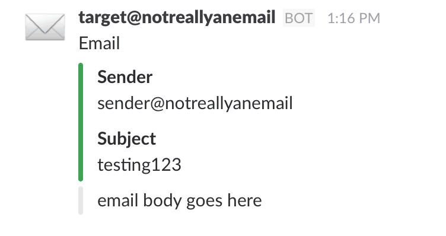

# Mailgun Slack Routes
### Easily connect an email address to a slack channel

Simple node script to route an email address (configured in mailgun) to a slack channel. By default this delivers to your personal DM channel on Slack. You'll have to define an environment variable for the Slack webhook, SLACK_URL.

On the command line: `SLACK_URL=https://slack.com/webhook/url/here node server.js`  
On Heroku: [Configuration and Config Vars](https://devcenter.heroku.com/articles/config-vars)

Here's what a message looks like in Slack:

